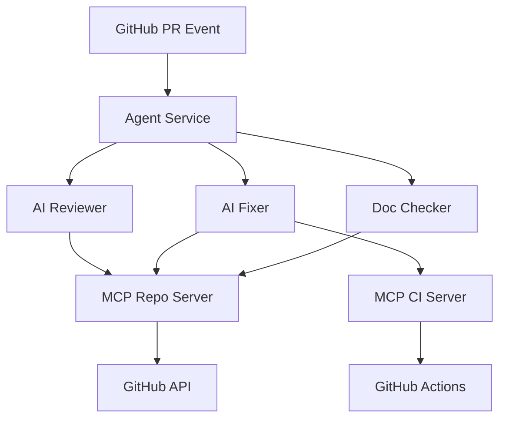

# 🤖 MCP DevOps PR Agent: Autonomous AI-Powered GitHub Workflows

An production-ready **Autonomous AI Agent** built for **DevOps automation** using the **Model Context Protocol (MCP)**. This system enables **LLM Orchestration** to provide **Auto-healing CI/CD**, proactive **Security Auditing**, and **Automated Documentation** enforcement.

> [!IMPORTANT]
> This project demonstrates advanced **AI Engineering** patterns including staggered task execution, exponential backoff for API resilience, and custom MCP server development.

[](https://opensource.org/licenses/MIT)
[](https://www.python.org/downloads/)
[](https://deepmind.google/technologies/gemini/)

---

## 🚀 Key Features

*   **🛠️ Autonomous Fixer**: Automatically analyzes GitHub Action failures, identifies the root cause, and pushes fix commits directly to your PR branch.
*   **📚 Auto-Docs**: Enforces docstring coverage. If a function is missing documentation, the agent generates and commits professional docstrings autonomously.
*   **🛡️ Security & Quality Audit**: Integrates `Bandit` (security) and `Flake8` (linting). Uses LLM intelligence to prioritize critical vulnerabilities over minor style nitpicks.
*   **⚡ Resilient Orchestration**: Built-in exponential backoff and staggered execution to handle high-frequency events even on API rate-limited free tiers.
*   **🔌 MCP Native**: Uses custom Model Context Protocol servers to securely bridge LLMs with your development environment (Git, CI, File System).

---

## 🏗️ Architecture

The system consists of three main layers:

1.  **Agent Service**: A FastAPI microservice that handles GitHub webhooks and orchestrates AI workflows.
2.  **MCP Tool Servers**:
    *   **Repo Server**: Handles Git operations (diffs, commits, file updates).
    *   **CI Server**: Bridges with GitHub Actions to fetch and analyze execution logs.
3.  **AI Engine**: Powered by **Gemini 3 Flash**, providing high-speed reasoning and code generation.



---

## 📦 Project Structure

```bash
├── agent_service/         # Core logic for AI workflows
│   ├── core/              # Reviewer, Fixer, Doc-Checker, Quality-Checker
│   └── main.py            # FastAPI Webhook Handler
├── mcp_servers/           # Custom Model Context Protocol implementations
│   ├── repo/              # Tooling for Git/Repository management
│   └── ci/                # Tooling for CI log analysis
├── scripts/               # Utility and verification scripts
└── docs/                  # In-depth setup and configuration guides
```

---

## ⚙️ Setup & Installation

### 1. Prerequisites
*   Python 3.11+
*   A GitHub App set up with a Private Key and Webhook secret.
*   A Google AI (Gemini) API Key.

### 2. Configure Environment
Create an `.env` file in `agent_service/`:
```env
GITHUB_APP_ID=your_app_id
GITHUB_PRIVATE_KEY_PATH=/path/to/your/key.pem
GITHUB_WEBHOOK_SECRET=your_secret
GOOGLE_API_KEY=your_gemini_key
```

### 3. Run the Agent
```bash
# Install dependencies
pip install -r agent_service/requirements.txt

# Start the service
export PYTHONPATH=$PYTHONPATH:.
python3 agent_service/main.py
```

### 4. Expose the Webhook
Use a tool like `localtunnel` to expose port 8000 to the internet for GitHub to reach:
```bash
npx localtunnel --port 8000 --subdomain your-custom-name
```

---

## 🤝 Contributing
Contributions are welcome! Please open an issue or submit a pull request for any improvements.

---

## 📜 License
This project is licensed under the MIT License - see the [LICENSE](LICENSE) file for details.
